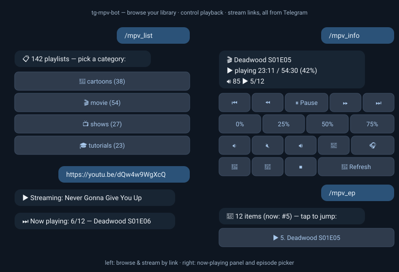

# tg-mpv-bot 🎬

[](https://github.com/antlis/tg-mpv-bot/actions/workflows/ci.yml)
[](LICENSE)

Turn Telegram into a remote control for **mpv** on your desktop/HTPC: browse
your media library with inline buttons, stream any YouTube/SoundCloud/… link
by just sending it, seek/pause/volume from your phone. No AI, no cloud — the
bot talks to mpv's JSON IPC socket directly from Python.

- 📋 **Browse** playlists by category with inline keyboards, or search
- 🔗 **Stream URLs** — send a link, mpv plays it via yt-dlp (1000+ sites)
- 🎛 **Now-playing panel** — transport, seek-to-%, volume, tracks, one message
- 📜 **Episode picker**, ▶ **continue watching**, 📸 **frame screenshots**
- 🪝 **Hooks** instead of WM assumptions — `i3-msg`/`swaymsg`/`notify-send`, your call



## The use case

A home server (or any always-on Linux box) is plugged into the TV over HDMI.
The bot runs on that box; **your phone — or any device with Telegram — is the
remote.**

```
   phone / laptop                home server ──HDMI──▶ TV
  ┌──────────────┐   Telegram   ┌─────────────────────────┐
  │  @your_bot   │ ───────────▶ │  tg-mpv-bot ──▶ mpv ────┼──▶ 📺
  │  /mpv_list   │              │  (X11/Wayland session)  │
  └──────────────┘              └─────────────────────────┘
```

From the couch: open Telegram, `/mpv_list`, tap a show — mpv opens fullscreen
on the TV. Send a YouTube link from your phone's share sheet — it streams on
the TV. Pause from the now-playing panel when the doorbell rings, drag the
volume, switch the audio track or subtitles, jump to episode 7 — all without
a keyboard, mouse, or smart-TV apps. `/mpv_last` resumes yesterday's episode
where you left off.

Because it's Telegram, the "remote" works from anywhere — same couch or other
side of the world — with no ports forwarded, no VPN, no local network setup:
the bot makes only outbound connections. `ALLOWED_USERS` keeps it yours.

## Commands

| Command | Description |
|---------|-------------|
| `/mpv_list` | Browse playlists with inline buttons (by category) |
| `/mpv_play <query>` | Search & play by name or number |
| `/mpv <query>` | Alias for `/mpv_play` |
| `/mpv_search [category] <text>` | List all matching playlists as play buttons (e.g. `/mpv_search tutorials docker`) |
| `/mpv_last` | Resume the last-played playlist or stream (position restored by mpv) |
| `/mpv_history` | Last 20 played (playlists & streams) — tap to replay |
| `/mpv_notify` | Toggle notifications: "⏭ Now playing: 5/12 — …" on episode change, "✅ Finished" at the end |
| `/mpv_url <link>` | Stream a URL via yt-dlp — or just **send a link** as a message |
| `/mpv_yt <search>` | Search YouTube from chat — top results as tap-to-play buttons |
| `/mpv_info` | Now-playing panel with inline transport buttons |
| `/mpv_shot` | Send a screenshot of the current frame to the chat |
| `/mpv_toggle` | Play/pause toggle (one command) |
| `/mpv_pause` | Pause playback |
| `/mpv_unpause` | Resume playback |
| `/mpv_quit` | Stop mpv and quit |
| `/mpv_fwd` | Seek forward 30s |
| `/mpv_back` | Seek backward 10s |
| `/mpv_goto <pos>` | Seek to `1:23:45`, `23:45`, `90` (seconds) or `75%` |
| `/mpv_next` | Next item in playlist |
| `/mpv_prev` | Previous item in playlist |
| `/mpv_ep [n]` | Episode picker with buttons (no arg) or jump to item N |
| `/mpv_speed [x]` | Playback speed — buttons (no arg) or a value like `1.5` |
| `/mpv_shuffle` | Shuffle the current playlist |
| `/mpv_loop` | Toggle looping the playlist |
| `/mpv_sleep <time>` | Sleep timer — stop playback after `45m` / `1.5h` (`off` to cancel) |
| `/mpv_audio` | Switch to the next audio track (e.g. Spanish → English) |
| `/mpv_sub` | Switch to the next subtitle track |
| `/mpv_sub_toggle` | Show / hide subtitles |
| `/mpv_volup` | Volume +10 |
| `/mpv_voldown` | Volume -10 |
| `/mpv_mute` | Toggle mute |
| `/mpv_doctor` | Report playlists with missing files on disk |
| `/mpv_fix` | Repair broken playlists (re-point moved files, prune dead) |
| `/mpv_scan` | Create playlists for newly-added media (idempotent) |
| `/mpv_update_ytdlp` | Update the bot's yt-dlp to the latest nightly — the usual fix when YouTube playback breaks |
| `/help` | Show this help |

## Quick Start

```bash
# 1. Create bot on @BotFather, get token
# 2. Copy env and configure
cp .env.example .env
# Edit .env → set BOT_TOKEN from @BotFather

# 3. Run with Docker
docker compose up -d --build

# Or run bare (no Docker)
pip install -r requirements.txt
python bot.py
```

## Tests & lint

```bash
pip install -r requirements-dev.txt
pytest
ruff check .
```

## Files

| Path | Purpose |
|------|---------|
| `bot.py` | Entry point — aiogram polling bot + auth middleware |
| `src/config.py` | Settings from env (single source of host paths) |
| `src/commands.py` | Telegram command + callback handlers |
| `src/mpv_ipc.py` | Direct JSON-IPC client for mpv (pause/seek/volume/info) |
| `src/playlists.py` | Playlist discovery, query matching, on-disk validation |
| `src/player.py` | Launch mpv (pkill + pre/post-play hooks + detached spawn) |
| `src/keyboards.py` | Inline-keyboard builders for browsing |
| `docker-compose.yml` | Docker deployment (host networking + X11 bind) |
| `Dockerfile` | Container build (Python 3.12 + mpv) |

## Deployment Options

### Docker (recommended)

```bash
cd ~/Projects/tg-mpv-bot
docker compose up -d --build
```

The container uses `network_mode: host` and binds X11 and video
directories for full mpv control.

### Systemd user service

```bash
ln -s ~/Projects/tg-mpv-bot/tg-mpv-bot.service ~/.config/systemd/user/
mkdir -p ~/.config/environment.d
cat > ~/.config/environment.d/99-tg-mpv-bot.conf << EOF
BOT_TOKEN=your_token_here
ALLOWED_USERS=123456789
EOF
systemctl --user daemon-reload
systemctl --user start tg-mpv-bot
systemctl --user enable tg-mpv-bot
```

## Access Control

Set `ALLOWED_USERS` in `.env` as comma-separated Telegram user IDs:

```env
ALLOWED_USERS=123456789,987654321
```

Get your ID from [@userinfobot](https://t.me/userinfobot). Leave empty to allow
everyone — **not recommended**, since anyone who finds the bot could control
your player.

## Architecture

```
                          ┌─ src/mpv_ipc  ──▶ mpv JSON IPC (/tmp/mpv-socket)   pause/seek/vol/info
Telegram ─▶ bot.py ─▶ src/commands ─┤
            (polling)   (+ auth mw)  ├─ src/playlists ──▶ scan ~/Videos/*/playlists/*.m3u
                                     └─ src/player   ──▶ pkill mpv · pre-hook · spawn mpv · post-hook ─▶ X11
```

Playback/volume/info commands write straight to mpv's IPC socket from Python.
Only launching a playlist (`/mpv_play`, tapping a button) spawns a process.

Window-manager glue is **not** built in — set the optional hooks instead
(shell commands; they see `$PLAYLIST`, `$PLAYLIST_NAME`, `$MPV_SOCKET`,
`$DISPLAY`):

```bash
PRE_PLAY_HOOK="i3-msg workspace 10"          # i3: jump to the media workspace
PRE_PLAY_HOOK="swaymsg workspace 10"         # sway
PRE_PLAY_HOOK="hyprctl dispatch workspace 10"  # Hyprland
POST_PLAY_HOOK='notify-send "Now playing" "$PLAYLIST_NAME"'
```

Hook failures are logged and never block playback (15s timeout).
`src/keyboards` renders the browse UI for `/mpv_list`: **category → (subcategory)
→ playlist**. Categories come from the top-level media dirs (cartoons / movie /
shows / tutorials); a playlists dir may nest one level of folders, which become
subcategories (tutorials are grouped by provider, e.g. `frontend-masters`).

## License

[MIT](LICENSE)
