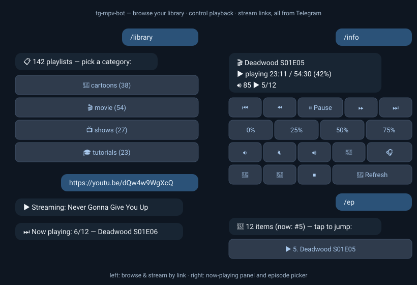

# tg-mpv-bot 🎬

[](https://github.com/antlis/tg-mpv-bot/actions/workflows/ci.yml)
[](https://aur.archlinux.org/packages/tg-mpv-bot-git)
[](LICENSE)

Turn Telegram into a remote control for **[mpv](https://mpv.io)** (the
free, scriptable media player that plays basically everything) on your
desktop/HTPC: browse your media library with inline buttons, stream any
YouTube/SoundCloud/… link by just sending it, seek/pause/volume from your
phone. No AI, no cloud — the bot talks to mpv's [JSON IPC
socket](https://mpv.io/manual/stable/#json-ipc) directly from Python.

- 📋 **Browse** playlists by category with inline keyboards, or search
- 🔗 **Stream URLs** — send a link, mpv plays it via yt-dlp (1000+ sites); custom site plugins and an optional headless-Chromium fallback cover pages yt-dlp can't read
- 📨 **Send a file** — forward any video/audio from Telegram, it plays on the TV
- 📥 **Upload what's playing** — the panel's 📥 button sends the current library file (or downloads the stream with a live progress bar first) to the chat; needs `API_SERVER_URL` for anything over 50 MB
- 🎛 **Now-playing panel** — rides on every "▶ Playing" message: transport,
  seek-to-%, volume, mute, tracks, 📸 shot, ⏺ clip, 📥 upload, 🗑 close
- 📜 **Episode picker**, ▶ **continue watching**, 📸 **frame screenshots**
- 🕘 **Watch history** (`/history`) — last 20 items, paginated; tap to replay, copy URL, or delete
- ⏺ **Record** the current video (→ H.264 mp4) or radio (→ voice message) and get it in chat
- 📺 **Live TV (IPTV)** — `/iptv <name>` searches 50 000+ channels from the [iptv-org](https://github.com/iptv-org/iptv) public catalogue and streams them live via mpv; channel logo sent as a photo card
- 🌐 **Remote play API** (opt-in) — `POST /play` with a link, `GET /status` and `POST /ctl` to drive playback, all behind a bearer token: send a link or pause the TV from a script, a phone shortcut or any other app, no Telegram needed
- 🪝 **Hooks** instead of WM assumptions — `i3-msg`/`swaymsg`/`notify-send`, your call



## The use case

A home server (or any always-on Linux box) is plugged into the TV over HDMI.
The bot runs on that box; **your phone — or any device with Telegram — is the
remote.**

```
   phone / laptop                home server ──HDMI──▶ TV
  ┌──────────────┐   Telegram   ┌─────────────────────────┐
  │  @your_bot   │ ───────────▶ │  tg-mpv-bot ──▶ mpv ────┼──▶ 📺
  │  /library   │              │  (X11/Wayland session)  │
  └──────────────┘              └─────────────────────────┘
```

From the couch: open Telegram, `/library`, tap a show — mpv opens fullscreen
on the TV. Send a YouTube link from your phone's share sheet — it streams on
the TV. Pause from the now-playing panel when the doorbell rings, drag the
volume, switch the audio track or subtitles, jump to episode 7 — all without
a keyboard, mouse, or smart-TV apps. `/last` resumes yesterday's episode
where you left off.

Because it's Telegram, the "remote" works from anywhere — same couch or other
side of the world — with no ports forwarded, no VPN, no local network setup:
the bot makes only outbound connections (unless you opt in to the
[remote play API](#remote-play-api)). `ALLOWED_USERS` keeps it yours.

## Commands

| Command | Description |
|---------|-------------|
| `/library` | Browse playlists with inline buttons (by category) |
| `/play <query>` | Search & play by name or number |
| `/mpv <query>` | Alias for `/play` |
| `/search [category] <text>` | List all matching playlists as play buttons (e.g. `/search tutorials docker`) |
| `/last` | Resume the last-played playlist or stream — playlist positions via mpv, stream positions via the bot's own 15s checkpoints |
| `/history`, `/recent` | Last 20 played — paginated (8/page), tap title to replay, icon to copy URL/path, 🗑 to delete |
| `/notify` | Toggle notifications: "⏭ Now playing: 5/12 — …" on episode change, "✅ Finished" at the end |
| `/url <link>` | Stream a URL via yt-dlp — or just **send a link** as a message |
| `/yt <search>` | Search YouTube from chat — top results as tap-to-play buttons |
| `/radio [search]` | Internet radio — presets (full SomaFM catalog, Radio Record, FIP, KEXP, …; yours via `RADIO_STATIONS`) or search ~50k stations on [radio-browser.info](https://www.radio-browser.info) |
| `/iptv [search]` | Live TV — search 50 000+ channels from the [iptv-org](https://github.com/iptv-org/iptv) public catalogue and stream live; `/iptv` with no args shows links to browse channels by country/category |
| *(send a video/audio file)* | Downloads and plays it — >20 MB needs `API_SERVER_URL` (local Bot API server) |
| `/info` | Now-playing panel with inline transport buttons — the same panel is attached to every "▶ Playing" / "📻 Tuned to" / "📺 Now streaming" message and to "⏭ Now playing" notifications (📸 frame shot, 📥 upload to chat, 🔈 unmute, 🗑 close included) |
| `/shot` | Send a screenshot of the current frame to the chat |
| `/record [duration]` · `/record START END` | Record what's playing — video → H.264 mp4, radio/audio → voice message — and send it to the chat. Run again (or tap ⏺ Stop) to finish; auto-stops at 1 h. `duration` accepts `30m`, `1h`, `HH:MM:SS`; `START END` (e.g. `01:30:00 02:00:00`) clips a specific range for local files — live streams use the duration and ignore the start |
| `/toggle` | Play/pause toggle (one command) |
| `/pause` | Pause playback |
| `/unpause` | Resume playback |
| `/quit` | Stop mpv and quit |
| `/fwd` | Seek forward 30s |
| `/back` | Seek backward 10s |
| `/goto <pos>` | Seek to `1:23:45`, `23:45`, `90` (seconds) or `75%` |
| `/next` | Next item in playlist |
| `/prev` | Previous item in playlist |
| `/ep [n]` | Episode picker with buttons (no arg) or jump to item N |
| `/chapters` | Chapter picker — movie/YouTube chapters as jump buttons |
| `/speed [x]` | Playback speed — buttons (no arg) or a value like `1.5` |
| `/shuffle` | Shuffle the current playlist |
| `/loop` | Toggle looping the playlist |
| `/sleep <time>` | Sleep timer — stop playback after `45m` / `1.5h` (`off` to cancel) |
| `/random [category]` | Play a random playlist — "just put something on" |
| `/night` | Toggle loudness normalization (quiet dialogue ↑, explosions ↓) |
| `/audio` | Switch to the next audio track (e.g. Spanish → English) |
| `/sub` | Switch to the next subtitle track |
| `/sub_toggle` | Show / hide subtitles |
| `/volup` | Volume +10 |
| `/voldown` | Volume -10 |
| `/mute` | Toggle mute |
| `/doctor` | Report playlists with missing files on disk |
| `/health` | One-screen health check: mpv, yt-dlp, Bot API server, library, disk space |
| `/fix` | Repair broken playlists (re-point moved files, prune dead) |
| `/scan` | Create playlists for newly-added media (idempotent) |
| `/update_ytdlp` | Update the bot's yt-dlp to the latest nightly — the usual fix when YouTube playback breaks |
| `/help` | Show this help |

## Setup

### 1. Prerequisites

- Linux box with a graphical session (X11 or Wayland) whose display is the TV
- [`mpv`](https://mpv.io) — in your distro's repos (`pacman -S mpv`, `apt install mpv`, …)
- For the **source** install: [`uv`](https://docs.astral.sh/uv/)
  (`curl -LsSf https://astral.sh/uv/install.sh | sh`) — manages Python and
  all dependencies, including `yt-dlp`

### 2. Create the bot

1. Message [@BotFather](https://t.me/BotFather) → `/newbot` → copy the token.
2. Get your numeric Telegram ID from [@userinfobot](https://t.me/userinfobot).

### 3. Install & first run

Pick one:

**A. From source (any distro)**

```bash
git clone https://github.com/antlis/tg-mpv-bot && cd tg-mpv-bot
uv sync                     # creates .venv with everything pinned by uv.lock

cp .env.example .env        # set BOT_TOKEN and ALLOWED_USERS at minimum
set -a; source .env; set +a
uv run bot.py
```

> **yt-dlp freshness:** `uv sync` installs the locked stable yt-dlp. YouTube
> breaks extraction faster than stable releases, so once the bot is running,
> send it `/update_ytdlp` (or set `YTDL_UPDATE_DAYS=7`) to bump the venv
> copy to the nightly — repeat after any future `uv sync`.

**B. Arch Linux ([AUR](https://aur.archlinux.org/packages/tg-mpv-bot-git))**

```bash
yay -S tg-mpv-bot-git       # deps incl. yt-dlp come from pacman/AUR

# configuration lives in one env file read by the packaged service:
install -m600 /usr/share/doc/tg-mpv-bot/env.example ~/.config/tg-mpv-bot.env
$EDITOR ~/.config/tg-mpv-bot.env        # BOT_TOKEN + ALLOWED_USERS at minimum

tg-mpv-bot                  # foreground test run (the launcher sources that
                            # env file); or go straight to the service below
```

On AUR installs `yt-dlp` is pacman's — keep it fresh with normal system
updates; `/update_ytdlp` only manages venv installs and will tell you so.
In the env file, **quote values containing spaces**
(`PRE_PLAY_HOOK="i3-msg workspace 10"`) — both the shell launcher and
systemd accept that form.

**C. Docker** — see [Run it permanently](#5-run-it-permanently).


Message your bot `/help` — if it answers, the Telegram side works. Then
`/library` to browse, or send any YouTube link.

> **Access control:** leave `ALLOWED_USERS` empty and *anyone* who finds the
> bot can control your TV. Set it.

### 4. Your media library

The browse UI expects this layout (category → playlists, with one optional
nesting level for subcategories):

```
~/Videos/
├── movie/
│   └── playlists/
│       ├── Fight Club.m3u
│       └── Heat (1995).m3u
├── shows/
│   └── playlists/
│       └── Deadwood S01.m3u
└── tutorials/
    └── playlists/
        └── frontend-masters/        ← subcategory
            └── Advanced CSS.m3u
```

- Categories = the directory names under `VIDEOS_DIR` (anything you like —
  the four above are just the defaults; set `PLAYLIST_DIRS` for a custom set).
- `.m3u` files are plain lists of media paths (absolute, or relative to the
  playlist's own directory).
- **Don't want to write playlists by hand?** Drop media files/folders under a
  category and run `/scan` — it generates one playlist per folder (or per
  loose file), idempotently. `/doctor` reports broken entries after you
  move things; `/fix` repairs them.
- No library at all is fine too — URL streaming, YouTube search and Telegram
  file playback work without one.

### 5. Run it permanently

**AUR install** — the unit ships with the package and reads
`~/.config/tg-mpv-bot.env` (created in step 3):

```bash
systemctl --user enable --now tg-mpv-bot
journalctl --user-unit tg-mpv-bot -f     # logs
```

**Source install — systemd user service:**

```bash
ln -s "$PWD/tg-mpv-bot.service" ~/.config/systemd/user/
mkdir -p ~/.config/environment.d
cat > ~/.config/environment.d/99-tg-mpv-bot.conf << EOF
BOT_TOKEN=your_token_here
ALLOWED_USERS=123456789
EOF
systemctl --user daemon-reload
systemctl --user enable --now tg-mpv-bot
journalctl --user-unit tg-mpv-bot -f     # logs
```

The unit assumes the repo at `~/Projects/tg-mpv-bot` with uv's `.venv/`
inside — edit `WorkingDirectory`/`ExecStart` if yours lives elsewhere. Tweak the
`Environment=` lines (hooks, yt-dlp options) in the unit itself.

**Docker:**

```bash
docker compose up -d --build
# or skip the build — releases are published to ghcr:
# docker pull ghcr.io/antlis/tg-mpv-bot:latest
```

Uses `network_mode: host` and bind-mounts the X11 socket, the mpv IPC socket
and your playlist dirs (paths in `docker-compose.yml`). Note hooks run
*inside* the container — add the tools they call to the image.

> ⚠️ Run exactly **one** instance per bot token (the lock file guards one
> host, but Telegram allows only one poller globally — a second instance
> elsewhere causes `TelegramConflictError`).

#### Docker gotchas

mpv runs *inside* the container (it's in the image) and renders onto the
host's X11 display over the bind-mounted socket. That setup has a few sharp
edges that don't show up until playback actually breaks — each cost real
debugging time, so they're documented here in full rather than left as a
one-line comment:

- **Bind-mount the socket's *directory*, not the socket file itself.** If
  the host path in a bind mount doesn't exist yet, Docker silently creates
  it as a directory — fine for a directory mount, wrong for a file mount.
  Point `MPV_SOCKET` at a path inside a directory you mount (e.g.
  `/tmp/tg-mpv-bot-run/mpv-socket` with `/tmp/tg-mpv-bot-run` as the
  volume), not at the exact socket path. Get this wrong and mpv's IPC
  bind fails silently — playback looks like it works but every `/*`
  control command times out. This also means the fix survives `/tmp`
  being cleared on reboot, unlike mounting the file path directly.
- **`MPV_RUNNER` should be empty in Docker.** It exists to point at a
  host-side wrapper script for non-container installs; since mpv now runs
  from inside the image, leave it unset (or `""`) so it falls back to the
  container's own `mpv` binary — pointing it at a host path that doesn't
  exist inside the container just wastes a stat() call.
- **Pass through `/dev/dri` or mpv's GPU output deadlocks.** Without a GPU
  device node in the container, mpv's default `vo=gpu` falls through
  vulkan → opengl → a broken partial EGL/DRI path and hangs completely —
  not just video, the *whole player* (IPC included) stops responding,
  confirmed via thread/futex inspection. Add:
  ```yaml
  devices:
    - /dev/dri:/dev/dri
  ```
  If the container doesn't run as root, also add the host's `video`
  group's numeric GID via `group_add` so the container user can open the
  card device (the render node, `renderD128`, is usually world-writable
  and doesn't need this).
- **No sound? Point `PULSE_SERVER` at the real socket.** The container
  runs as root while the host's PipeWire/PulseAudio socket is owned by
  your desktop user — libpulse's *default* runtime-dir discovery flatly
  refuses that combination (`XDG_RUNTIME_DIR ... not owned by us ...
  don't do that`), and mpv silently falls through to a working-but-silent
  audio output. Skip that discovery path by setting the server directly:
  ```yaml
  environment:
    PULSE_SERVER: "unix:/run/user/<your-uid>/pulse/native"
  volumes:
    - /run/user/<your-uid>:/run/user/<your-uid>:rw
  ```
  If sound still seems dead after this, check mpv's own `mute` property
  before suspecting the pipeline again — `echo '{"command":["get_property","mute"]}' | socat - UNIX-CONNECT:/tmp/tg-mpv-bot-run/mpv-socket`
  — it's a separate flag from the OS mixer and stays set across launches
  of the same instance.
- **Keyboard shortcuts (space/m/seek) doing nothing → focus the window
  explicitly, with the *right* mechanism.** A container-launched window
  isn't reliably left focused by every WM the way a host-native process's
  would be. Fix it with a `POST_PLAY_HOOK` that calls `xdotool ... windowactivate`
  — but not `windowfocus`. `windowactivate` sends a proper EWMH
  `_NET_ACTIVE_WINDOW` client message and lets the WM do the actual
  focusing, keeping its internal state consistent. `windowfocus` is a raw
  `XSetInputFocus` call that bypasses the WM; under i3 specifically this
  desyncs the WM's focus bookkeeping from the X server's real input focus
  (confirmed via `XGetInputFocus` reverting to `PointerRoot` — keyboard
  input following whatever's under the mouse, not the window i3 *reports*
  as focused — the next time i3 touches focus, e.g. on a workspace
  switch). If you drive the box remotely over `x2x`/`x2vnc`, note those
  tools *also* rely on `PointerRoot`-style, mouse-position-driven focus on
  the target display — WM-level focus commands (`windowactivate`,
  `i3-msg focus`) may not be sufficient on their own, and bouncing to
  another workspace and back is a reliable manual fallback worth
  automating in the hook if you hit this.

### Nix

The flake packages the bot with `mpv`, `yt-dlp` and `ffmpeg` on its `PATH`:

```bash
nix run github:antlis/tg-mpv-bot            # BOT_TOKEN etc. from the environment
nix build .#with-browser                    # + headless-Chromium fallback
nix develop                                 # dev shell (uv, ruff, mpv, yt-dlp)
```

For a home-manager setup, import `homeManagerModules.default` and enable
`services.tg-mpv-bot` (`environmentFile` holds `BOT_TOKEN`; `settings` takes the
env vars from `.env.example`). yt-dlp comes from nixpkgs, so
`/update_ytdlp` is unavailable — bump the flake input instead.

**Nix and Docker are alternatives — run only one.** Both poll the same token,
and each has its own `/tmp`, so the single-instance lock can't see across them.
The module sets `LOCK_FILE` under `$XDG_RUNTIME_DIR`; to guard both, bind-mount
that file into the container and set the same `LOCK_FILE` there.

## Configuration

Everything is configured via environment variables. Where they live depends
on the install method — the variables themselves are identical:

| Install | Configuration file |
|---------|--------------------|
| Source, foreground | `.env` in the repo (`set -a; source .env; set +a`) |
| Source, systemd | `~/.config/environment.d/99-tg-mpv-bot.conf` + `Environment=` lines in the unit |
| AUR | `~/.config/tg-mpv-bot.env` (read by both the launcher and the unit) |
| Nix | a file outside the store, via the module's `environmentFile` (or `EnvironmentFile=` in your own unit) + `settings` |
| Docker | `environment:` / `env_file:` in `docker-compose.yml` |

Only `BOT_TOKEN` is required.

| Variable | Default | Purpose |
|----------|---------|---------|
| `BOT_TOKEN` | — *(required)* | Bot token from @BotFather |
| `ALLOWED_USERS` | *(empty = open!)* | Comma-separated Telegram user IDs allowed to use the bot |
| `VIDEOS_DIR` | `~/Videos` | Library root — categories are its subdirectories |
| `PLAYLIST_DIRS` | `$VIDEOS_DIR/{cartoons,movie,shows,tutorials}/playlists` | Explicit playlist dirs (`:`-separated) if your layout differs |
| `MPV_SOCKET` | `/tmp/mpv-socket` | mpv JSON IPC socket the bot creates/controls — in Docker, point this inside a *mounted directory* rather than at the bare path (see [Docker gotchas](#docker-gotchas)) |
| `DISPLAY` | `:0` | X11 display the mpv window opens on |
| `MPV_RUNNER` | `/tmp/mpv-runner.sh` | Optional wrapper script to launch instead of `mpv` (plain `mpv` when absent) — leave empty in Docker, mpv runs from the image itself |
| `PRE_PLAY_HOOK` | *(none)* | Shell command run before mpv starts — WM glue like `i3-msg workspace 10`; sees `$PLAYLIST`, `$PLAYLIST_NAME`, `$MPV_SOCKET`, `$DISPLAY` |
| `POST_PLAY_HOOK` | *(none)* | Same, run right after the mpv spawn — useful for explicit window-focus glue in Docker (see [Docker gotchas](#docker-gotchas)) |
| `KILL_STRAY_MPV` | `1` | Also `pkill` mpv instances the bot didn't start; `0` if you use mpv manually too |
| `YTDL_FORMAT` | `bv*[height<=1080]+ba/b` | yt-dlp format for URL streaming (raise the cap for 4K) |
| `YTDL_SUB_LANGS` | `en.*` | Subtitle/auto-caption languages fetched for streams (`--sub-langs` syntax; empty disables) — toggle on screen with `/sub` |
| `MEDIA_PROXY` | *(none)* | Proxy for non-YouTube playback — the yt-dlp probe and mpv's fetch both use it, so IP-locked CDN URLs stay coherent; for hosts whose direct line can't reach some media CDNs |
| `PLUGIN_DIR` / `ENABLE_PLUGINS` | *(none)* / `true` | Directory of custom extractor plugins (`.py` with `match()` + `resolve()`, see `examples/plugin_example.py`); run before yt-dlp. Docker mounts `./plugins` at `/plugins` |
| `ENABLE_BROWSER_FALLBACK` / `BROWSER_FALLBACK_TIMEOUT` | `true` / `45` | When yt-dlp can't load a page, sniff its stream in headless Chromium and play that. Docker: build with `INSTALL_BROWSER=true` (~450 MB) |
| `ENABLE_UPLOAD` | `true` | Show the panel's 📥 button (upload what's playing to the chat). Streams are downloaded first; needs `ffmpeg` to merge separate video+audio (Docker: build with `INSTALL_FFMPEG=true`; also needed by ⏺ record/clip). Over 50 MB needs `API_SERVER_URL` |
| `RADIO_STATIONS` | *(curated dozen)* | `/radio` presets as `Name=URL,Name=URL` (first `=` splits, so `?listen_key=` URLs work) — replaces the built-in list |
| `YTDL_OPTIONS` | *(none)* | Extra yt-dlp options, comma-separated `key=value` / bare flags — e.g. `force-ipv4` or the lean-YouTube `extractor-args=…` (see `.env.example`). Network-pinning keys (`force-ipv4/6`, `proxy`, …) apply to **YouTube URLs only** — other sites' IP-locked CDNs need the probe and mpv on the same default network path |
| `YTDL_COOKIES_BROWSER` | *(none)* | Browser whose cookies unlock Instagram/Facebook and YouTube bot-checks (e.g. `firefox`); applied only to gated hosts / as an escalation, never globally |
| `API_SERVER_URL` | *(none)* | Local [Bot API server](https://github.com/tdlib/telegram-bot-api) — lifts the 20 MB download cap to 2 GB for sent files, and the 50 MB cap on the panel's 📥 upload to 2 GB (one-time `…/logOut` from the cloud API required when switching) |
| `API_LOCAL_FILES_DIR` | *(none)* | Host path of the server's `/var/lib/telegram-bot-api` when it runs with `TELEGRAM_LOCAL=true` — the bot then reads downloaded files straight from disk |
| `SCAN_INTERVAL_MIN` | `0` | If >0, auto-run the playlist generator every N minutes |
| `YTDL_UPDATE_DAYS` | `0` | If >0, auto-update yt-dlp every N days (recommended: `7`) and report version bumps in chat |
| `REMOTE_PLAY_TOKEN` | *(none, API off)* | Turns on the [remote play API](#remote-play-api) and is the bearer token it requires |
| `REMOTE_PLAY_BIND` | `127.0.0.1:8085` | `host:port` the remote play API listens on (a LAN or Tailscale address to reach it from other machines) |
| `STATE_FILE` | `~/.local/state/tg-mpv-bot/state.json` | Watch history / notification target |
| `LOCK_FILE` | `/tmp/tg-mpv-bot.lock` | Single-instance lock |

## Remote play API

Play a link on the TV without opening Telegram — and drive the player afterwards: from a script, a
phone shortcut, a home-automation rule, a browser bookmarklet or any app that can send an HTTP
request.

Off by default. Everything else in the bot is outbound-only (Telegram polling); this is the one
place it listens, so it needs `REMOTE_PLAY_TOKEN` and binds to `127.0.0.1:8085` unless you set
`REMOTE_PLAY_BIND` (use a LAN or Tailscale address, never a public one). Every request carries
`Authorization: Bearer $REMOTE_PLAY_TOKEN`.

```bash
H="Authorization: Bearer $REMOTE_PLAY_TOKEN"

# start a link — the same hooks/history/resume as one sent in a chat
curl -H "$H" -d '{"url": "https://www.youtube.com/watch?v=dQw4w9WgXcQ", "start": 83.5}' \
     http://tv-box:8085/play
# {"ok": true, "title": "..."}

# what is on the TV right now
curl -H "$H" http://tv-box:8085/status
# {"ok": true, "playing": true, "title": "...", "position": 12.5, "duration": 240.0,
#  "percent": 5.2, "paused": false, "volume": 100.0, "mute": false, "speed": 1.0, ...}

# pause, jump, volume, stop
curl -H "$H" -d '{"action": "pause"}'   http://tv-box:8085/ctl   # also: resume, toggle
curl -H "$H" -d '{"action": "back"}'    http://tv-box:8085/ctl   # -10 s; fwd is +30 s
curl -H "$H" -d '{"action": "seek", "position": 754}' http://tv-box:8085/ctl   # exact, in seconds
curl -H "$H" -d '{"action": "voldown"}' http://tv-box:8085/ctl   # volup, mute, unmute
curl -H "$H" -d '{"action": "stop"}'    http://tv-box:8085/ctl
```

`POST /play` takes an `http(s)` link and an optional `start` position in seconds, and plays it the
way a link sent in a chat does (the same pre/post-play hooks, watch history and resume), minus the
Telegram messages. Piped streams (YouTube) can't honour `--start` at load — a pipe isn't seekable —
so the offset is reached over mpv's IPC socket as soon as the buffer has read that far: a far-in
resume lands a second or two after the reply, not at 0. It answers once playback has started: `400`
for a bad request, `401` for a missing or wrong token, `422` with the reason when the link can't be
played. Other schemes (`file://`, `ytdl://`, …) are refused.

**A queue**: `{"urls": [...], "index": 3, "start": 83}` plays up to 200 links one after another, from
`index` (default the first; `start` belongs to that item). The reply comes when the first one has
started (`{"ok": true, "title": …, "queued": 5}`, or the first link's `422`); the bot then starts each
next link itself when a video ends, so the sender can close and walk away. A link that can't play
is passed over. `next` and `prev` (`POST /ctl`, and the Telegram panel's buttons) move through the
queue, and `GET /status` has `"queue": {"position": 2, "count": 5, "error": null}` (`null` when there
is none; between two items `playing` is false for a moment but the call stays `200`). The queue
gives way to anything else: a new `POST /play`, a link sent in the chat, or mpv going away before the
end of a video (`/quit`, `stop`). A video ending is told from one vanishing within 5 seconds of its
end, so a live stream doesn't continue into the next item.

**A longer list** goes in chunks: `POST /queue` with `{"urls": [...]}` (up to 200 per request) adds
links to the end of the running queue, up to 2000 in all (`409` when no queue is running, `422`
past the limit). The `count` in `GET /status`'s `queue` grows with it.

`GET /status` reports the current item in one JSON object with a stable shape — `playing` is false
while mpv is idle, and the call is `503` when mpv isn't running at all. `POST /ctl` takes
`{"action": …}`: `400` (listing the valid actions) for an unknown one, `503` when mpv is down, `422`
with mpv's own reason if it rejects the command. The actions are the ones the Telegram panel offers —
`toggle`, `pause`, `resume`, `back`, `fwd`, `prev`, `next`, `volup`, `voldown`, `mute`, `unmute`,
`sub`, `audio`, `p0`/`p25`/`p50`/`p75`, `shuffle`, `loop`, `stop` — and both sides read the same
table, so a control added there shows up in both at once.

`seek` is the one extra: it takes a `position` in seconds (`400` unless it is a number in 0–7 days) and jumps there exactly.

Keep the token private (it is a password for your TV), and don't
expose the port to the internet: bind it to a LAN or Tailscale address, or leave it on localhost and
reach it through an SSH tunnel (`ssh -L 8085:127.0.0.1:8085 tv-box`).

## Tests & lint

```bash
uv run pytest
uv run ruff check .
```

## Files

| Path | Purpose |
|------|---------|
| `bot.py` | Entry point — aiogram polling bot + auth middleware |
| `src/config.py` | Settings from env (single source of host paths) |
| `src/commands.py` | Telegram command + callback handlers |
| `src/iptv.py` | IPTV command + callbacks — M3U fetch/cache, channel search, streaming via `player.play_radio` |
| `src/mpv_ipc.py` | Direct JSON-IPC client for mpv (pause/seek/volume/info) + the shared `CTL_ACTIONS` table |
| `src/playlists.py` | Playlist discovery, query matching, on-disk validation |
| `src/player.py` | Launch mpv (pkill + pre/post-play hooks + detached spawn) |
| `src/remote.py` | Remote play API: `POST /play`, `GET /status`, `POST /ctl` behind a bearer token (off unless `REMOTE_PLAY_TOKEN` is set) |
| `src/remote_queue.py` | The queue behind `POST /play` with `urls`: starts the next link when mpv ends one |
| `src/keyboards.py` | Inline-keyboard builders for browsing and watch history |
| `src/state.py` | Watch history state (JSON) — record, query, delete entries |
| `docker-compose.yml` | Docker deployment (host networking + X11 bind) |
| `Dockerfile` | Container build (Python 3.11 + mpv + i3-wm + xdotool) |
| `flake.nix`, `packaging/nix/` | Nix package (`.#default`, `.#with-browser`), dev shell, home-manager module |
| `packaging/aur/` | Arch `PKGBUILD` + user unit |

## Architecture

```
                          ┌─ src/ipc  ──▶ mpv JSON IPC (/tmp/mpv-socket)   pause/seek/vol/info
Telegram ─▶ bot.py ─▶ src/commands ─┤
            (polling)   (+ auth mw)  ├─ src/playlists ──▶ scan ~/Videos/*/playlists/*.m3u
                                     └─ src/player   ──▶ pkill mpv · pre-hook · spawn mpv · post-hook ─▶ X11
```

Playback/volume/info commands write straight to mpv's IPC socket from Python.
Only launching a playlist (`/play`, tapping a button) spawns a process.

Window-manager glue is **not** built in — set the optional hooks instead
(shell commands; they see `$PLAYLIST`, `$PLAYLIST_NAME`, `$MPV_SOCKET`,
`$DISPLAY`):

```bash
PRE_PLAY_HOOK="i3-msg workspace 10"          # i3: jump to the media workspace
PRE_PLAY_HOOK="swaymsg workspace 10"         # sway
PRE_PLAY_HOOK="hyprctl dispatch workspace 10"  # Hyprland
POST_PLAY_HOOK='notify-send "Now playing" "$PLAYLIST_NAME"'
```

Hook failures are logged and never block playback (15s timeout).
`src/keyboards` renders the browse UI for `/library`: **category → (subcategory)
→ playlist**. Categories come from the top-level media dirs (cartoons / movie /
shows / tutorials); a playlists dir may nest one level of folders, which become
subcategories (tutorials are grouped by provider, e.g. `frontend-masters`).

## License

[MIT](LICENSE)
